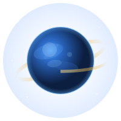

# JHD · 星空行星个人站点

<p align="center">
  
</p>

<p align="center">
  <strong>记录每一个完成的成品 · 在星轨中留下足迹</strong>
</p>

<p align="center">
  <a href="https://Adxs-hm.github.io/"></a>
  <a href="https://github.com/Adxs-hm/Adxs-hm.github.io/actions"></a>
  
  
  
</p>

---

## 这是什么

**JHD** 是一个基于 Hugo 静态站点生成器构建的个人成果记录网站。它不只是博客——它是所有完成项目的**统一入口和展示平台**。

设计理念：**每个成品都是一颗小星球，而这个站点是它们运行的轨道。**

## 特性

- 🪐 **星空行星视觉主题** — 深色太空背景、行星粒子、轨道装饰、银河光带
- 🎨 **双层 CSS 架构** — SCSS 编译时注入 + 静态 CSS 运行时叠加
- ✨ **交互特效** — 鼠标视差、卡片光影追随、滚动入场动画、数值递增
- 🔍 **客户端全文搜索** — 基于 Fuse.js + 自定义搜索面板，支持键盘导航
- 📱 **响应式布局** — 桌面端/移动端适配
- 🚀 **自动部署** — GitHub Actions push 即部署到 GitHub Pages
- 📂 **项目展示系统** — 按领域分类的项目卡片网格
- 🏷️ **智能返回导航** — 根据文章分类自动切换返回路径

## 内容结构

| 分区 | 说明 |
|------|------|
| 🏠 首页 | 打字机标语 + 最新文章列表 |
| 📝 文章 | 日常记录、对战复盘、随笔随想 |
| 🎯 项目 | 按领域分类的项目卡片（游戏开发 / AI 角色扮演 / 世界观设定 / 网站建设） |
| 🗿 里程碑 | 关键节点追踪（已完成 / 进行中 / 计划中） |
| 👤 关于 | 站点介绍 |

## 快速开始

```bash
# 克隆仓库
git clone https://github.com/Adxs-hm/Adxs-hm.github.io.git
cd Adxs-hm.github.io

# 安装 Hugo Extended v0.163.3+
# 参考: https://gohugo.io/installation/

# 本地预览
hugo server -D
# 打开 http://localhost:1313

# 构建
hugo
# 输出在 public/ 目录
```

## 技术栈

| 层 | 技术 |
|---|---|
| 静态站点生成 | Hugo v0.163.3 Extended |
| 主题 | [LoveIt](https://github.com/dillonzq/LoveIt) |
| 部署 | GitHub Pages |
| CI/CD | GitHub Actions |
| 搜索 | Fuse.js（客户端） |
| 样式 | SCSS + CSS（双层策略） |
| 脚本 | 原生 JavaScript（无框架） |

## 项目定制

除 LoveIt 主题之外的自定义部分：

- **4 个自定义模板**: `baseof.html`、`section.html`、`posts/single.html`、`articles/single.html`
- **1 个自定义 shortcode**: `sketchfab`（3D 模型嵌入）
- **1 个 SCSS 覆盖文件**: `_custom.scss`（编译时注入深空配色）
- **1 个主题 CSS**: `space-theme-v2.css`（4000+ 行星空视觉效果）
- **2 个 JS 模块**: `space-fx.js`（交互特效）、`jhd-search.js`（搜索组件）
- **1 个 SVG 头像**: `planet-avatar.svg`（动态行星）

详细架构说明参见 [CLAUDE.md](CLAUDE.md)。

## 许可证

MIT License

---

<p align="center">
  <sub>Made with ❤️ by JHD · 在星轨中留下足迹</sub>
</p>
